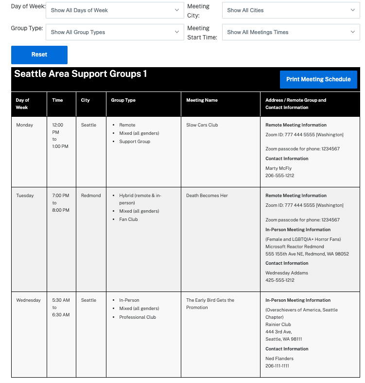
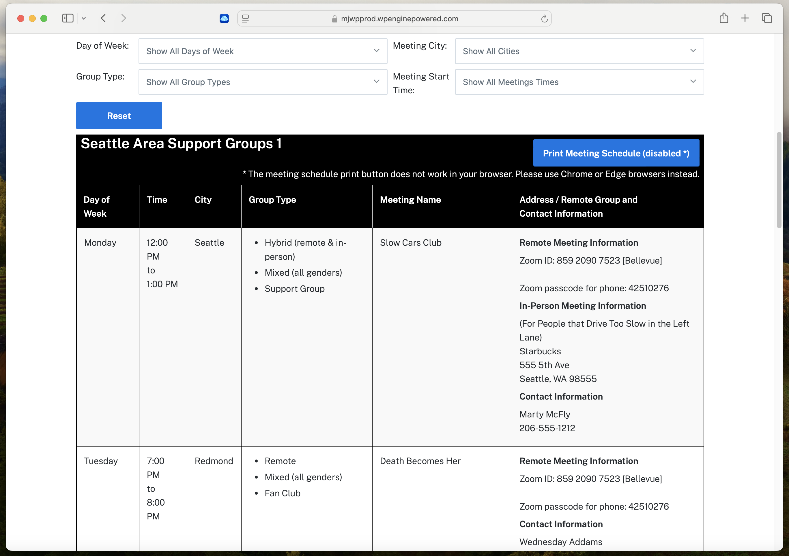

# Weekly Meetings List Block (WordPress Plugin)

## Summary (TLDR)

- Add a block to show a table of ongoing weekly meetings. Some examples could be for a book club, support group, meditation group, or a religious studies group.
- The block will output an HTML table with drop-down filters like **Show All Days of Week**, **Show All Cities**, etc.

### Screeshots
- **Chrome Browser on Mac Desktop**  
  A screenshot of the block below on a live page (zoomed out on the Chrome browser):  
  

- **Chrome Browser on Mac Desktop Animated GIF**  
  An animated GIF showing drop-down filter on a Chrome browser on a MacBook Pro laptop, like choosing __Meeeting City > Redmond__ to only show weekly meetings that meeting Redmond, WA, USA:  
  

- **Chrome Browser on Pixel 7 Android Phone Animated GIF**  
  An animated GIF showing drop-down filter on a Chrome browser on a Pixel 7 Android phone, like choosing __Day of Week > Monday__ to only show weekly meetings that only meet on Monday:  
  

- **Safari Browser on Mac Desktop**  
  A screenshot below of the block in the Safari browser, which shows that the a print meeting schedule with __Print Meeting Schedule (disabled \*)__ text as this button is disabled on Safari and Firefox browsers as the print CSS doesn't work correctly.  
  
  Also there's text under this button with links to Chrome and Edge browsers for an alternative (see text: <strong>\* The meeting schedule print button does not work in your browser. Please use <ins>Chrome</ins> or <ins>Edge</ins> browsers instead.</strong>).  
   

### Demo Link  
See the block on a live page (see **Seattle Area Support Groups** heading inside the table, which is a part of the block):  
[https://mjwpprod.wpenginepowered.com/weekly-meetings-block-wordpress-plugin/](https://mjwpprod.wpenginepowered.com/weekly-meetings-block-wordpress-plugin/)

## Longer Introduction
The Weekly Meetings Block blocks include:

- Filter drop-downs (like **Show All Days of Week**, which includes a select tag)
- A **Reset** button
- A **Print Meeting Schedule** button that only works on the live page on a large screen (laptop or desktop)
- This plugin is still being worked on and some features are not done (like styles)

## Web Developer Information

### Installation

**Easy: Download and Install the Plugin**
1. Go to the [Releases](https://github.com/Hollyw00d/weekly-meetings-list-block/releases) page and where you see the `Latest` heading click on the link that says something like `weekly-meetings-list-block.0.1.0.zip` to download the latest plugin. 
2. :warning: **IMPORTANT:**  
   Do NOT click on `Source code (zip)` or `Source code (tar.gz)` links as these don't point to release files and GitHub automatically creates these links.
3. Use the information below to manually install the plugin on your WordPress site:
   - [How to Install a WordPress Plugin from .ZIP File](https://www.youtube.com/watch?v=CZ1-duHGk4o) (YouTube - under 2 minutes)   
   - [How to install a WordPress plugin from a ZIP file](https://www.wonderplugin.com/wordpress-tutorials/how-to-manually-install-a-wordpress-plugin-zip-file/) (wonderplugin.com)

**Hard: Build the Plugin with Node.js and Install It**
1. Fork or download the code from this GitHub repo
2. In your terminal:
   - Go into the **weekly-meetings-list-block** folder (like `cd weekly-meetings-list-block`) and install npm packages by doing:  
     `npm i`
   - Build the plugin by running:  
     `npm run build`
   - Output the zipped plugin inside the **weekly-meetings-list-block** folder by running:  
     `npm run plugin-zip`
3. Now you will see a zipped file named **weekly-meetings-list-block.0.10.zip** or similar as this zipped file will including the WordPress version name from the root PHP file (see the `Version` text in the comment near the top of the file):  
   **weekly-meetings-list-block.php**
4. Log into the WP Admin for your WordPress website and install the **weekly-meetings-list-block.0.1.0.zip** plugin manually.
5. Starter code below to add 3 duplicate **Weekly Meetings List Block** blocks that can be inserted using the Code Editor ([see **Using The Code Editor To Edit The Entire Post Or Page** in this documentation page for details](https://www.boldgrid.com/support/wordpress-tutorials/how-to-use-the-code-editor-in-the-gutenberg-editor/)):

    ```
    <!-- wp:create-block/meetings-table-block {"tableTitle":"Seattle Area Support Groups 1","citiesArr":["Redmond","Seattle"],"groupTypesArr":["location~Hybrid (remote \u0026 in-person)","location~Remote","location~In-Person","gender~Mixed (all genders)","Fan Club","Professional Club","Support Group"]} -->
    <div class="wp-block-create-block-meetings-table-block wp-block-create-block-meetings-table-block_save"><div class="wp-block-create-block-meetings-table-block__filters__wrapper"><div class="wp-block-create-block-meetings-table-block__filters"><label><div>Day of Week:</div><div><select class="day-of-week-filter" name="days of week"><option value="">Show All Days of Week</option><option value="1_monday">Monday</option><option value="2_tuesday">Tuesday</option><option value="3_wednesday">Wednesday</option><option value="4_thursday">Thursday</option><option value="5_friday">Friday</option><option value="6_saturday">Saturday</option><option value="7_sunday">Sunday</option></select></div></label><label><div>Meeting City:</div><div><select class="city-filter" name="cities"><option value="">Show All Cities</option><option value="Redmond">Redmond</option><option value="Seattle">Seattle</option></select></div></label><label><div>Group Type:</div><div><select class="group-type-filter" name="group types"><option value="">Show All Group Types</option><option value="location~Hybrid (remote &amp; in-person)">Hybrid (remote &amp; in-person)</option><option value="location~Remote">Remote</option><option value="location~In-Person">In-Person</option><option value="gender~Mixed (all genders)">Mixed (all genders)</option><option value="Fan Club">Fan Club</option><option value="Professional Club">Professional Club</option><option value="Support Group">Support Group</option></select></div></label><label><div>Meeting Start Time:</div><div><select class="start-time-filter" name="meeting start times"><option value="">Show All Meetings Times</option><option value="asc~">Show Earliest to Latest Meetings</option><option value="desc~">Show Latest to Earliest Meetings</option></select></div></label><div><button class="wp-block-create-block-meetings-table-block_reset-btn">Reset</button></div></div></div><table><caption class="table-title"><h2>Seattle Area Support Groups 1<div class="notification" role="alert" aria-live="polite"></div></h2><button class="print">Print Meeting Schedule</button></caption><thead><tr role="row"><th role="columnheader" scope="col">Day of Week</th><th role="columnheader" scope="col">Time</th><th role="columnheader" scope="col">City</th><th role="columnheader" scope="col">Group Type</th><th role="columnheader" scope="col">Meeting Name</th><th role="columnheader" scope="col">Address / Remote Group and<br/>Contact Information</th></tr></thead><tbody class="original-data"><!-- wp:create-block/meetings-table-row-block {"day":"1_monday","mtgStartTime":"12:00","mtgEndTime":"13:00","city":"Seattle","locationGroupType":"location~Hybrid (remote \u0026 in-person)","genderGroupType":"gender~Mixed (all genders)","additionalGroupType":"Support Group","meetingName":"Slow Cars Club","remoteMtgInfoClass":"show","inPersonMtgInfoClass":"show"} -->
    <tr class="wp-block-create-block-meetings-table-row-block" data-filter-day="1_monday" data-filter-city="Seattle" data-location-group-type="location~Hybrid (remote &amp; in-person)" data-access-group-type="" data-gender-group-type="gender~Mixed (all genders)" data-additional-group-type="Support Group" data-start-time="12:00"><td data-heading-label="Day of Week">Monday</td><td data-heading-label="Time">12:00 PM<br/>to<br/>1:00 PM</td><td data-heading-label="City">Seattle</td><td data-heading-label="Group Type"><ul><li>Hybrid (remote &amp; in-person)</li><li>Mixed (all genders)</li><li>Support Group</li></ul></td><td data-heading-label="Meeting Name">Slow Cars Club</td><td data-heading-label="Address / Remote Group and Contact Information"><p class="show"><strong>Remote Meeting Information</strong></p><p class="remote-mtg-info show">Zoom ID: 859 2090 7523 [Bellevue]<br><br>Zoom passcode for phone: 42510276</p><p class="show"><strong>In-Person Meeting Information</strong></p><p class="in-person-mtg-info show">(For People that Drive Too Slow in the Left Lane)<br>Starbucks<br>555 5th Ave<br>Seattle, WA 98555</p><p><strong>Contact Information</strong></p><p class="contact-info">Marty McFly<br>206-555-1212</p><p class="hide"><strong>More Details</strong></p><p class="more-details hide"></p></td></tr>
    <!-- /wp:create-block/meetings-table-row-block -->

    <!-- wp:create-block/meetings-table-row-block {"day":"2_tuesday","mtgStartTime":"19:00","mtgEndTime":"20:00","city":"Redmond","locationGroupType":"location~Remote","genderGroupType":"gender~Mixed (all genders)","additionalGroupType":"Fan Club","meetingName":"Death Becomes Her","remoteMtgInfoClass":"show"} -->
    <tr class="wp-block-create-block-meetings-table-row-block" data-filter-day="2_tuesday" data-filter-city="Redmond" data-location-group-type="location~Remote" data-access-group-type="" data-gender-group-type="gender~Mixed (all genders)" data-additional-group-type="Fan Club" data-start-time="19:00"><td data-heading-label="Day of Week">Tuesday</td><td data-heading-label="Time">7:00 PM<br/>to<br/>8:00 PM</td><td data-heading-label="City">Redmond</td><td data-heading-label="Group Type"><ul><li>Remote</li><li>Mixed (all genders)</li><li>Fan Club</li></ul></td><td data-heading-label="Meeting Name">Death Becomes Her</td><td data-heading-label="Address / Remote Group and Contact Information"><p class="show"><strong>Remote Meeting Information</strong></p><p class="remote-mtg-info show">Zoom ID: 859 2090 7523 [Bellevue]<br><br>Zoom passcode for phone: 42510276</p><p class="hide"><strong>In-Person Meeting Information</strong></p><p class="in-person-mtg-info hide">(Female and LGBTQIA+ Horror Fans)<br>Microsoft Reactor Redmond<br>555 155th Ave NE, Redmond, WA 98052</p><p><strong>Contact Information</strong></p><p class="contact-info">Wednesday Addams<br>425-555-1212</p><p class="hide"><strong>More Details</strong></p><p class="more-details hide"></p></td></tr>
    <!-- /wp:create-block/meetings-table-row-block -->

    <!-- wp:create-block/meetings-table-row-block {"day":"3_wednesday","mtgStartTime":"05:30","mtgEndTime":"06:30","city":"Seattle","locationGroupType":"location~In-Person","genderGroupType":"gender~Mixed (all genders)","additionalGroupType":"Professional Club","meetingName":"The Early Bird Gets the Promotion","inPersonMtgInfoClass":"show"} -->
    <tr class="wp-block-create-block-meetings-table-row-block" data-filter-day="3_wednesday" data-filter-city="Seattle" data-location-group-type="location~In-Person" data-access-group-type="" data-gender-group-type="gender~Mixed (all genders)" data-additional-group-type="Professional Club" data-start-time="05:30"><td data-heading-label="Day of Week">Wednesday</td><td data-heading-label="Time">5:30 AM<br/>to<br/>6:30 AM</td><td data-heading-label="City">Seattle</td><td data-heading-label="Group Type"><ul><li>In-Person</li><li>Mixed (all genders)</li><li>Professional Club</li></ul></td><td data-heading-label="Meeting Name">The Early Bird Gets the Promotion</td><td data-heading-label="Address / Remote Group and Contact Information"><p class="hide"><strong>Remote Meeting Information</strong></p><p class="remote-mtg-info hide">Zoom ID: 859 2090 7523 [Bellevue]<br><br>Zoom passcode for phone: 42510276</p><p class="show"><strong>In-Person Meeting Information</strong></p><p class="in-person-mtg-info show">(Overachievers of America, Seattle Chapter)<br>Rainier Club<br>444 3rd Ave, <br>Seattle, WA 98111</p><p><strong>Contact Information</strong></p><p class="contact-info">Ned Flanders<br>206-111-1111</p><p class="hide"><strong>More Details</strong></p><p class="more-details hide"></p></td></tr>
    <!-- /wp:create-block/meetings-table-row-block --></tbody></table></div>
    <!-- /wp:create-block/meetings-table-block -->

    <!-- wp:create-block/meetings-table-block {"tableTitle":"Seattle Area Support Groups 2","citiesArr":["Redmond","Seattle"],"groupTypesArr":["location~In-Person","gender~Mixed (all genders)","Fan Club","Professional Club","Support Group"]} -->
    <div class="wp-block-create-block-meetings-table-block wp-block-create-block-meetings-table-block_save"><div class="wp-block-create-block-meetings-table-block__filters__wrapper"><div class="wp-block-create-block-meetings-table-block__filters"><label><div>Day of Week:</div><div><select class="day-of-week-filter" name="days of week"><option value="">Show All Days of Week</option><option value="1_monday">Monday</option><option value="2_tuesday">Tuesday</option><option value="3_wednesday">Wednesday</option><option value="4_thursday">Thursday</option><option value="5_friday">Friday</option><option value="6_saturday">Saturday</option><option value="7_sunday">Sunday</option></select></div></label><label><div>Meeting City:</div><div><select class="city-filter" name="cities"><option value="">Show All Cities</option><option value="Redmond">Redmond</option><option value="Seattle">Seattle</option></select></div></label><label><div>Group Type:</div><div><select class="group-type-filter" name="group types"><option value="">Show All Group Types</option><option value="location~In-Person">In-Person</option><option value="gender~Mixed (all genders)">Mixed (all genders)</option><option value="Fan Club">Fan Club</option><option value="Professional Club">Professional Club</option><option value="Support Group">Support Group</option></select></div></label><label><div>Meeting Start Time:</div><div><select class="start-time-filter" name="meeting start times"><option value="">Show All Meetings Times</option><option value="asc~">Show Earliest to Latest Meetings</option><option value="desc~">Show Latest to Earliest Meetings</option></select></div></label><div><button class="wp-block-create-block-meetings-table-block_reset-btn">Reset</button></div></div></div><table><caption class="table-title"><h2>Seattle Area Support Groups 2<div class="notification" role="alert" aria-live="polite"></div></h2><button class="print">Print Meeting Schedule</button></caption><thead><tr role="row"><th role="columnheader" scope="col">Day of Week</th><th role="columnheader" scope="col">Time</th><th role="columnheader" scope="col">City</th><th role="columnheader" scope="col">Group Type</th><th role="columnheader" scope="col">Meeting Name</th><th role="columnheader" scope="col">Address / Remote Group and<br/>Contact Information</th></tr></thead><tbody class="original-data"><!-- wp:create-block/meetings-table-row-block {"day":"1_monday","mtgStartTime":"12:00","mtgEndTime":"13:00","city":"Seattle","locationGroupType":"location~In-Person","genderGroupType":"gender~Mixed (all genders)","additionalGroupType":"Support Group","meetingName":"Slow Cars Club","inPersonMtgInfoClass":"show"} -->
    <tr class="wp-block-create-block-meetings-table-row-block" data-filter-day="1_monday" data-filter-city="Seattle" data-location-group-type="location~In-Person" data-access-group-type="" data-gender-group-type="gender~Mixed (all genders)" data-additional-group-type="Support Group" data-start-time="12:00"><td data-heading-label="Day of Week">Monday</td><td data-heading-label="Time">12:00 PM<br/>to<br/>1:00 PM</td><td data-heading-label="City">Seattle</td><td data-heading-label="Group Type"><ul><li>In-Person</li><li>Mixed (all genders)</li><li>Support Group</li></ul></td><td data-heading-label="Meeting Name">Slow Cars Club</td><td data-heading-label="Address / Remote Group and Contact Information"><p class="hide"><strong>Remote Meeting Information</strong></p><p class="remote-mtg-info hide">Zoom ID: 859 2090 7523 [Bellevue]<br><br>Zoom passcode for phone: 42510276</p><p class="show"><strong>In-Person Meeting Information</strong></p><p class="in-person-mtg-info show">(For People that Drive Too Slow in the Left Lane)<br>Starbucks<br>555 5th Ave<br>Seattle, WA 98555</p><p><strong>Contact Information</strong></p><p class="contact-info">Marty McFly<br>206-555-1212</p><p class="hide"><strong>More Details</strong></p><p class="more-details hide"></p></td></tr>
    <!-- /wp:create-block/meetings-table-row-block -->

    <!-- wp:create-block/meetings-table-row-block {"day":"2_tuesday","mtgStartTime":"19:00","mtgEndTime":"20:00","city":"Redmond","locationGroupType":"location~In-Person","genderGroupType":"gender~Mixed (all genders)","additionalGroupType":"Fan Club","meetingName":"Death Becomes Her","inPersonMtgInfoClass":"show"} -->
    <tr class="wp-block-create-block-meetings-table-row-block" data-filter-day="2_tuesday" data-filter-city="Redmond" data-location-group-type="location~In-Person" data-access-group-type="" data-gender-group-type="gender~Mixed (all genders)" data-additional-group-type="Fan Club" data-start-time="19:00"><td data-heading-label="Day of Week">Tuesday</td><td data-heading-label="Time">7:00 PM<br/>to<br/>8:00 PM</td><td data-heading-label="City">Redmond</td><td data-heading-label="Group Type"><ul><li>In-Person</li><li>Mixed (all genders)</li><li>Fan Club</li></ul></td><td data-heading-label="Meeting Name">Death Becomes Her</td><td data-heading-label="Address / Remote Group and Contact Information"><p class="hide"><strong>Remote Meeting Information</strong></p><p class="remote-mtg-info hide">Zoom ID: 859 2090 7523 [Bellevue]<br><br>Zoom passcode for phone: 42510276</p><p class="show"><strong>In-Person Meeting Information</strong></p><p class="in-person-mtg-info show">(Female and LGBTQIA+ Horror Fans)<br>Microsoft Reactor Redmond<br>555 155th Ave NE, Redmond, WA 98052</p><p><strong>Contact Information</strong></p><p class="contact-info">Wednesday Addams<br>425-555-1212</p><p class="hide"><strong>More Details</strong></p><p class="more-details hide"></p></td></tr>
    <!-- /wp:create-block/meetings-table-row-block -->

    <!-- wp:create-block/meetings-table-row-block {"day":"3_wednesday","mtgStartTime":"05:30","mtgEndTime":"06:30","city":"Seattle","locationGroupType":"location~In-Person","genderGroupType":"gender~Mixed (all genders)","additionalGroupType":"Professional Club","meetingName":"The Early Bird Gets the Promotion","inPersonMtgInfoClass":"show"} -->
    <tr class="wp-block-create-block-meetings-table-row-block" data-filter-day="3_wednesday" data-filter-city="Seattle" data-location-group-type="location~In-Person" data-access-group-type="" data-gender-group-type="gender~Mixed (all genders)" data-additional-group-type="Professional Club" data-start-time="05:30"><td data-heading-label="Day of Week">Wednesday</td><td data-heading-label="Time">5:30 AM<br/>to<br/>6:30 AM</td><td data-heading-label="City">Seattle</td><td data-heading-label="Group Type"><ul><li>In-Person</li><li>Mixed (all genders)</li><li>Professional Club</li></ul></td><td data-heading-label="Meeting Name">The Early Bird Gets the Promotion</td><td data-heading-label="Address / Remote Group and Contact Information"><p class="hide"><strong>Remote Meeting Information</strong></p><p class="remote-mtg-info hide">Zoom ID: 859 2090 7523 [Bellevue]<br><br>Zoom passcode for phone: 42510276</p><p class="show"><strong>In-Person Meeting Information</strong></p><p class="in-person-mtg-info show">(Overachievers of America, Seattle Chapter)<br>Rainier Club<br>444 3rd Ave, <br>Seattle, WA 98111</p><p><strong>Contact Information</strong></p><p class="contact-info">Ned Flanders<br>206-111-1111</p><p class="hide"><strong>More Details</strong></p><p class="more-details hide"></p></td></tr>
    <!-- /wp:create-block/meetings-table-row-block --></tbody></table></div>
    <!-- /wp:create-block/meetings-table-block -->

    <!-- wp:create-block/meetings-table-block {"tableTitle":"Seattle Area Support Groups 3","citiesArr":["Redmond","Seattle"],"groupTypesArr":["location~In-Person","gender~Mixed (all genders)","Fan Club","Professional Club","Support Group"]} -->
    <div class="wp-block-create-block-meetings-table-block wp-block-create-block-meetings-table-block_save"><div class="wp-block-create-block-meetings-table-block__filters__wrapper"><div class="wp-block-create-block-meetings-table-block__filters"><label><div>Day of Week:</div><div><select class="day-of-week-filter" name="days of week"><option value="">Show All Days of Week</option><option value="1_monday">Monday</option><option value="2_tuesday">Tuesday</option><option value="3_wednesday">Wednesday</option><option value="4_thursday">Thursday</option><option value="5_friday">Friday</option><option value="6_saturday">Saturday</option><option value="7_sunday">Sunday</option></select></div></label><label><div>Meeting City:</div><div><select class="city-filter" name="cities"><option value="">Show All Cities</option><option value="Redmond">Redmond</option><option value="Seattle">Seattle</option></select></div></label><label><div>Group Type:</div><div><select class="group-type-filter" name="group types"><option value="">Show All Group Types</option><option value="location~In-Person">In-Person</option><option value="gender~Mixed (all genders)">Mixed (all genders)</option><option value="Fan Club">Fan Club</option><option value="Professional Club">Professional Club</option><option value="Support Group">Support Group</option></select></div></label><label><div>Meeting Start Time:</div><div><select class="start-time-filter" name="meeting start times"><option value="">Show All Meetings Times</option><option value="asc~">Show Earliest to Latest Meetings</option><option value="desc~">Show Latest to Earliest Meetings</option></select></div></label><div><button class="wp-block-create-block-meetings-table-block_reset-btn">Reset</button></div></div></div><table><caption class="table-title"><h2>Seattle Area Support Groups 3<div class="notification" role="alert" aria-live="polite"></div></h2><button class="print">Print Meeting Schedule</button></caption><thead><tr role="row"><th role="columnheader" scope="col">Day of Week</th><th role="columnheader" scope="col">Time</th><th role="columnheader" scope="col">City</th><th role="columnheader" scope="col">Group Type</th><th role="columnheader" scope="col">Meeting Name</th><th role="columnheader" scope="col">Address / Remote Group and<br/>Contact Information</th></tr></thead><tbody class="original-data"><!-- wp:create-block/meetings-table-row-block {"day":"1_monday","mtgStartTime":"12:00","mtgEndTime":"13:00","city":"Seattle","locationGroupType":"location~In-Person","genderGroupType":"gender~Mixed (all genders)","additionalGroupType":"Support Group","meetingName":"Slow Cars Club","inPersonMtgInfoClass":"show"} -->
    <tr class="wp-block-create-block-meetings-table-row-block" data-filter-day="1_monday" data-filter-city="Seattle" data-location-group-type="location~In-Person" data-access-group-type="" data-gender-group-type="gender~Mixed (all genders)" data-additional-group-type="Support Group" data-start-time="12:00"><td data-heading-label="Day of Week">Monday</td><td data-heading-label="Time">12:00 PM<br/>to<br/>1:00 PM</td><td data-heading-label="City">Seattle</td><td data-heading-label="Group Type"><ul><li>In-Person</li><li>Mixed (all genders)</li><li>Support Group</li></ul></td><td data-heading-label="Meeting Name">Slow Cars Club</td><td data-heading-label="Address / Remote Group and Contact Information"><p class="hide"><strong>Remote Meeting Information</strong></p><p class="remote-mtg-info hide">Zoom ID: 859 2090 7523 [Bellevue]<br><br>Zoom passcode for phone: 42510276</p><p class="show"><strong>In-Person Meeting Information</strong></p><p class="in-person-mtg-info show">(For People that Drive Too Slow in the Left Lane)<br>Starbucks<br>555 5th Ave<br>Seattle, WA 98555</p><p><strong>Contact Information</strong></p><p class="contact-info">Marty McFly<br>206-555-1212</p><p class="hide"><strong>More Details</strong></p><p class="more-details hide"></p></td></tr>
    <!-- /wp:create-block/meetings-table-row-block -->

    <!-- wp:create-block/meetings-table-row-block {"day":"2_tuesday","mtgStartTime":"19:00","mtgEndTime":"20:00","city":"Redmond","locationGroupType":"location~In-Person","genderGroupType":"gender~Mixed (all genders)","additionalGroupType":"Fan Club","meetingName":"Death Becomes Her","inPersonMtgInfoClass":"show"} -->
    <tr class="wp-block-create-block-meetings-table-row-block" data-filter-day="2_tuesday" data-filter-city="Redmond" data-location-group-type="location~In-Person" data-access-group-type="" data-gender-group-type="gender~Mixed (all genders)" data-additional-group-type="Fan Club" data-start-time="19:00"><td data-heading-label="Day of Week">Tuesday</td><td data-heading-label="Time">7:00 PM<br/>to<br/>8:00 PM</td><td data-heading-label="City">Redmond</td><td data-heading-label="Group Type"><ul><li>In-Person</li><li>Mixed (all genders)</li><li>Fan Club</li></ul></td><td data-heading-label="Meeting Name">Death Becomes Her</td><td data-heading-label="Address / Remote Group and Contact Information"><p class="hide"><strong>Remote Meeting Information</strong></p><p class="remote-mtg-info hide">Zoom ID: 859 2090 7523 [Bellevue]<br><br>Zoom passcode for phone: 42510276</p><p class="show"><strong>In-Person Meeting Information</strong></p><p class="in-person-mtg-info show">(Female and LGBTQIA+ Horror Fans)<br>Microsoft Reactor Redmond<br>555 155th Ave NE, Redmond, WA 98052</p><p><strong>Contact Information</strong></p><p class="contact-info">Wednesday Addams<br>425-555-1212</p><p class="hide"><strong>More Details</strong></p><p class="more-details hide"></p></td></tr>
    <!-- /wp:create-block/meetings-table-row-block -->

    <!-- wp:create-block/meetings-table-row-block {"day":"3_wednesday","mtgStartTime":"05:30","mtgEndTime":"06:30","city":"Seattle","locationGroupType":"location~In-Person","genderGroupType":"gender~Mixed (all genders)","additionalGroupType":"Professional Club","meetingName":"The Early Bird Gets the Promotion","inPersonMtgInfoClass":"show"} -->
    <tr class="wp-block-create-block-meetings-table-row-block" data-filter-day="3_wednesday" data-filter-city="Seattle" data-location-group-type="location~In-Person" data-access-group-type="" data-gender-group-type="gender~Mixed (all genders)" data-additional-group-type="Professional Club" data-start-time="05:30"><td data-heading-label="Day of Week">Wednesday</td><td data-heading-label="Time">5:30 AM<br/>to<br/>6:30 AM</td><td data-heading-label="City">Seattle</td><td data-heading-label="Group Type"><ul><li>In-Person</li><li>Mixed (all genders)</li><li>Professional Club</li></ul></td><td data-heading-label="Meeting Name">The Early Bird Gets the Promotion</td><td data-heading-label="Address / Remote Group and Contact Information"><p class="hide"><strong>Remote Meeting Information</strong></p><p class="remote-mtg-info hide">Zoom ID: 859 2090 7523 [Bellevue]<br><br>Zoom passcode for phone: 42510276</p><p class="show"><strong>In-Person Meeting Information</strong></p><p class="in-person-mtg-info show">(Overachievers of America, Seattle Chapter)<br>Rainier Club<br>444 3rd Ave, <br>Seattle, WA 98111</p><p><strong>Contact Information</strong></p><p class="contact-info">Ned Flanders<br>206-111-1111</p><p class="hide"><strong>More Details</strong></p><p class="more-details hide"></p></td></tr>
    <!-- /wp:create-block/meetings-table-row-block --></tbody></table></div>
    <!-- /wp:create-block/meetings-table-block -->
    ```

### More Plugin Details

This plugin was built using:

- [Gutenberg Blocks](https://wordpress.org/documentation/article/wordpress-block-editor/)
- React
- Vanilla JavaScript (JavaScript with no frameworks or libraries)
- SCSS
- HTML
- PHP
